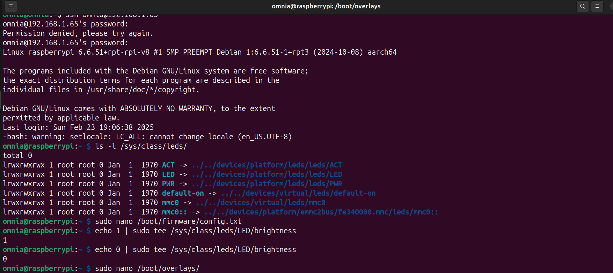

## **Modifying the Device Tree to Configure an LED on Raspberry Pi GPIO**  


---

## **1. Understanding What We Need to Do**  
The Raspberry Pi **Device Tree** describes **all hardware**, including GPIOs.  

To **control an LED**, we need to:  
1. **Choose a GPIO pin** to use. (e.g., GPIO17 → Pin 11 on Raspberry Pi).  
2. **Modify the Device Tree** to configure GPIO17 as an output.  
3. **Enable the LED driver** in the Device Tree.  
4. **Apply the changes** and test the LED.  

---

## **2. Finding the GPIO Controller in the Device Tree**
We first need to check the **GPIO controller** in the Device Tree.

Run:  
```bash
ls /proc/device-tree/soc/
```
or  
```bash
ls /sys/firmware/devicetree/base/soc/
```
You'll see something like:
```
gpio@7e200000
```
This means the GPIO controller is at **address `0x7e200000`** (BCM2835/BCM2711 GPIO).

To confirm:
```bash
cat /proc/device-tree/soc/gpio@7e200000/compatible
```
Output:
```
brcm,bcm2711-gpio
```
This tells us that the **Broadcom GPIO driver** is managing the GPIO hardware.

---

## **3. Checking Available GPIOs**
Now, we want to **list available GPIOs**.

Run:
```bash
ls /proc/device-tree/soc/gpio@7e200000/
```
You'll see various entries like:
```
#gpio-cells  gpio-controller  interrupts  reg  compatible  status
```
This confirms the GPIO hardware is available.

Now, let’s check if GPIO17 is free:
```bash
ls /sys/class/gpio/
```
If `gpio17` is **not present**, it means the kernel has not configured it yet.

---

## **4. Modifying the Device Tree to Add an LED**
### **A. Create a Device Tree Overlay (DTS)**
Instead of modifying the base Device Tree (which can be risky), we create a **Device Tree Overlay (DTO)** to add the LED configuration.

1. **Create a new DTS file:**
```bash
nano /boot/overlays/simple-led.dts
```
2. **Add this content** to define an LED on GPIO17:
```dts
/dts-v1/;
/plugin/;

/ {
    fragment@0 {
        target-path = "/leds";
        __overlay__ {
            my_led {
                compatible = "gpio-leds";
                label = "LED";
                gpios = <&gpio 17 0>;  // GPIO 17, Active High
                default-state = "off";
                linux,default-trigger = "none";
            };
        };
    };
};
```

### **B. Compile the Overlay**
Use `dtc` (Device Tree Compiler) to compile the DTS file into a DTBO:
```bash
sudo dtc -@ -I dts -O dtb -o /boot/firmware/overlays/simple-led.dtbo /boot/overlays/simple-led.dts
```
Now, `simple-led.dtbo` is ready.

---

## **5. Applying the Device Tree Overlay**
### **A. Edit `config.txt` to Load the Overlay**
Add this line to `/boot/firmware/config.txt`:
```ini
dtoverlay=simple-led
```
This tells the bootloader to apply our **LED configuration**.

### **B. Reboot**
```bash
sudo reboot
```

---

## **6. Testing the LED**
After rebooting, the LED should now be controlled via `/sys/class/leds`.

### **Check if the LED is recognized**
```bash
ls /sys/class/leds/
```
You should see:
```
LED
```

### **Turn ON the LED**
```bash
echo 1 | sudo tee /sys/class/leds/LED/brightness
```

### **Turn OFF the LED**
```bash
echo 0 | sudo tee /sys/class/leds/LED/brightness
```
#### Result


---

## **7. Summary: What We Did**
1. **Checked the GPIO controller** in `/proc/device-tree/soc/gpio@7e200000`.
2. **Created a Device Tree Overlay (DTS)** to define an LED on GPIO17.
3. **Compiled the overlay** into a `.dtbo` file.
4. **Copied the `.dtbo` to `/boot/firmware/overlays/`** and updated `config.txt`.
5. **Rebooted** and verified the LED appeared in `/sys/class/leds/`.
6. **Controlled the LED using `/sys/class/leds/LED/brightness`**.

---

## **8. Why Use Device Tree for GPIO?**
- **Persistent Configuration:** Unlike `gpio export` methods, Device Tree changes are permanent.
- **Kernel Managed:** The kernel recognizes and handles the LED properly.
- **No Manual Pin Setup Needed:** It’s all handled via the boot process.


